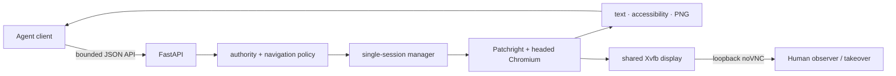

<p align="center">
  
</p>

<h1 align="center">Aether Browser</h1>
<h2 align="center">See what your agent sees.</h2>

<p align="center">
  Self-hosted Chrome for AI agents. Control it through an API and watch or take over the
  exact same browser session through noVNC.
</p>

<p align="center">
  <a href="https://github.com/AetherAI3/aetherbrowser/actions/workflows/ci.yml"></a>
  <a href="LICENSE"></a>
  
  
  
</p>

<p align="center">
  <a href="#quickstart">Quickstart</a> ·
  <a href="docs/API.md">API</a> ·
  <a href="docs/SECURITY.md">Security model</a> ·
  <a href="CONTRIBUTING.md">Contributing</a> ·
  <a href="docs/RELEASE_EVIDENCE.md">Release status</a>
</p>

> [!IMPORTANT]
> **Private v0.1.0 release-candidate work is in progress.** The repository is not approved for
> public release, and Aether Browser is not presented as a hosted service. Exact-main container,
> dedicated-runner, acceptance, and demo evidence must be recorded before the RC is complete.

### Exact-release demo

The demo will appear here only after it is captured from the exact tested release commit. No
mock or earlier-build media is substituted. The capture checklist and currently unfilled proof
fields are in [`docs/DEMO_EVIDENCE.md`](docs/DEMO_EVIDENCE.md).

## Quickstart

The supported one-command quickstart uses **Docker Engine on Linux** with Docker Compose v2.
It builds the source checkout, starts Xvfb, x11vnc, noVNC, the API, and one headed Chromium
runtime, and binds both user-facing listeners to the host's numeric loopback interface.

```bash
docker compose up --build
```

Once the health endpoint responds, open the live browser view at
[`http://127.0.0.1:6080/vnc.html`](http://127.0.0.1:6080/vnc.html) and check the API from another
terminal:

```bash
curl -fsS http://127.0.0.1:8092/browser/health | jq .
```

The first build downloads the pinned Python environment and Patchright browser payload, so it
can take several minutes. Compose uses Linux host networking to keep the unauthenticated v0.1
noVNC surface on numeric loopback; Docker Desktop and remote-host deployment are not part of
this quickstart contract. Stop the foreground process with `Ctrl+C`.

## Three-command API example

With the Compose runtime healthy and `curl` plus `jq` installed, these three commands create a
session, navigate, and inspect structured state. Local loopback mode intentionally needs no
bearer token; see the [authority contract](docs/API.md#transport-and-authority) before changing
that deployment shape.

```bash
SESSION_ID="$(curl -fsS -X POST http://127.0.0.1:8092/browser/session/create -H 'Content-Type: application/json' -d '{"api_version":"v1"}' | jq -er '.session_id')"
curl -fsS -X POST http://127.0.0.1:8092/browser/navigate -H 'Content-Type: application/json' -d "{\"api_version\":\"v1\",\"session_id\":\"${SESSION_ID}\",\"url\":\"https://example.com\"}" | jq '{status, final_url, title, readable_text}'
curl -fsS -X POST http://127.0.0.1:8092/browser/snapshot -H 'Content-Type: application/json' -d "{\"api_version\":\"v1\",\"session_id\":\"${SESSION_ID}\"}" | jq '{status, url, title, sequence, vision_steps_remaining, screenshot_base64_chars: (.screenshot_base64 | length)}'
```

When finished, release the owned browser resources:

```bash
curl -fsS -X POST http://127.0.0.1:8092/browser/session/end -H 'Content-Type: application/json' -d "{\"api_version\":\"v1\",\"session_id\":\"${SESSION_ID}\"}" | jq .
```

The same flow is available as [`examples/curl.sh`](examples/curl.sh).

## What happened

1. `session/create` started one headed Chrome session and returned its UUID plus the local noVNC
   view URL.
2. `navigate` validated the destination, pinned allowed addresses, and changed the page shown in
   the shared display.
3. `snapshot` returned bounded text, accessibility state, viewport metadata, sequence counters,
   and a PNG of that same page.
4. The human view and API did not create competing browsers: they met at one owned session.

## Why Aether Browser

- **One session, two participants.** Agents act through JSON while a human can watch and take
  over the exact display locally.
- **Structure before pixels.** Readable text and a bounded accessibility representation are
  available before a client spends a vision step on a screenshot.
- **A small control surface.** The v0.1 API exposes explicit browser actions rather than a shell,
  arbitrary JavaScript, or raw DevTools access.
- **Model-agnostic and self-hosted.** Bring the agent framework you already use and keep the
  browser runtime on infrastructure you control.

## Current capabilities

| Capability | v0.1 contract |
|---|---|
| Browser | One headed Chromium session launched through Patchright |
| State | URL, title, readable text, bounded accessibility nodes, viewport, and PNG snapshot |
| Actions | Navigate, click, type, scroll, and allowlisted key presses |
| Human view | The same Xvfb display through loopback-only x11vnc and noVNC |
| Ownership | One explicit UUID session with expiry, vision budget, and idempotent cleanup |
| Authority | Observer/controller separation when authenticated; strict local loopback mode otherwise |
| Navigation | HTTP(S)-only validation across requested, redirected, and browser-initiated navigation |

Request and response shapes, limits, and stable error codes are documented in
[`docs/API.md`](docs/API.md).

## Architecture



The session manager owns the page, browser context, temporary profile, timers, counters, and
cleanup. The API and the live view are different interfaces to that shared resource, not two
independent automation paths. See [`docs/ARCHITECTURE.md`](docs/ARCHITECTURE.md).

## Security boundary

- API and noVNC listen on numeric loopback by default; noVNC remains loopback-only in v0.1.
- Remote API clients require a separately operated same-host HTTPS reverse proxy, an exact
  trusted loopback peer, strict Host validation, and distinct strong observer/controller tokens.
- Destination validation rejects credentials, unsupported schemes, blocked address classes,
  unsafe redirects, and DNS rebinding. Browser egress is pinned through an owned TCP proxy.
- Non-proxied WebRTC UDP is disabled so it cannot silently bypass the TCP egress boundary.
- Inputs, outputs, interactions, timeouts, lifetimes, and screenshot budgets are bounded.
- Cleanup converges on session end, expiry, launch failure, application shutdown, and process
  failure.

The trust assumptions and residual risks are explicit in [`docs/SECURITY.md`](docs/SECURITY.md).
Report vulnerabilities privately through [`SECURITY.md`](SECURITY.md); do not open a public
security issue.

### Source recovery and exclusions

The source-recovery rule is **reuse general browser behavior, not private domain code**.
Lifecycle, structured-state, interaction, and cleanup patterns may be adapted from authorized
references; ATS/trading integrations, broker or account selectors, order actions, secrets,
and credential injection are excluded from the public core. Provenance status is tracked in
[`docs/SOURCE-RECOVERY.md`](docs/SOURCE-RECOVERY.md).

## What it does not do

- No hosted cloud service, cloud control plane, or production remote-hosting claim.
- No bundled LLM, account system, dashboard, credential vault, or credential injection.
- No CAPTCHA bypass, anti-detection guarantee, stealth claim, or proxy rotation.
- No arbitrary JavaScript, shell, filesystem, upload, clipboard, download, or raw CDP API.
- No multi-session pool, ATS integration, trading integration, or brokerage behavior.

## Roadmap

Four intentionally separable contribution tracks are prepared for publication after the v0.1
contract is frozen:

1. TypeScript client for the current API contract.
2. Python context-manager SDK.
3. Multi-session worker pool with explicit isolation and capacity semantics.
4. Session trace and recording export with clear privacy controls.

These are roadmap candidates, not shipped features or fabricated issue links.

## Contributing

Start with [`CONTRIBUTING.md`](CONTRIBUTING.md), the
[`Code of Conduct`](CODE_OF_CONDUCT.md), and the current [`API contract`](docs/API.md). Small,
well-tested changes that preserve the narrow authority boundary are welcome once the repository
is published. Security reports use the private process in [`SECURITY.md`](SECURITY.md).

## License and third-party notices

Aether-owned code is licensed under the [Apache License 2.0](LICENSE). Dependencies, browser
payloads, system packages, fonts, and bundled web assets remain under their respective terms;
see [`THIRD_PARTY_NOTICES.md`](THIRD_PARTY_NOTICES.md). A source checkout that builds locally is
the v0.1 distribution target until binary redistribution review is complete.

<p align="center"><strong>Aether Browser</strong> · See what your agent sees.</p>
